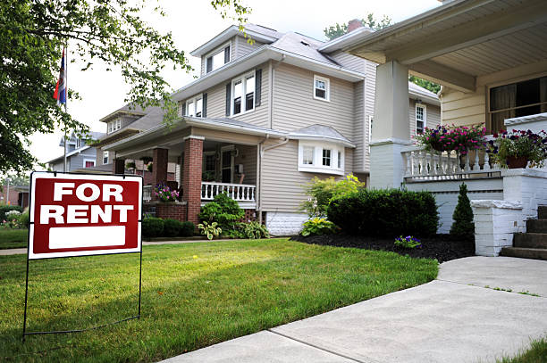

# India-House-Rent-Prediction



## Project Overview
This project focus on using certain features such as Size of house, Furnishing type, Area type(carpet area, built area), Tenant Type, number of bathrooms to predict the sellig price of the House.
LSTM Neural Network was the model deployed for the prediction.

## Data Source
The dataset contains 4746 rows( each rows represent a patient), and 12 columns of various medical condtions. [See Here](https://github.com/KoreJosh/India-House-Rent-Prediction/files/14449360/House_Rent_Dataset.2.csv)

## Tools
- google colab, Python's Jupter lab

## Data Cleaning / Preparation

- Data Loading and Inspection
  - Using the .shape(), it shows that the dataset has 4745 rows and 12 columns
- Handling missing values and duplicates
  - Using .isnull().sum() function, it appreas the dataset has no mising values, also using the .duplicated().sum() function, no duplicate values was recorded.
    
## Exploratory Data Analysis


### Rent in Different Cities according to BHK:
Checked for the Rent in different Cities based on the BHK
  
   ```
sns.barplot(data=df,x=df['City'],y=df['Rent'], hue=df['BHK'],ci=None)
plt.xlabel('City')
plt.ylabel('Rent')
plt.title('Rent in Different Cities According to BHK')
```


### Rent in Different Cities according to Area Type

Examine the Price of House rent in different Cities based on the Area Type of the Houses.


### Rent in Different Cities According Furnishing status

House Rent in Different Cities based in the Furnishing of the house whether (semi-furnished, unfurnished, fully-furnished)


### Number of Houses available for rent in each city


### Number of Houses available for rent based on the type of preferred tenant


### Predictive Modelling
To carry out the prediction, the categorical dependent features were mapped out, to be better understood by the model

```
df["Area Type"] = df["Area Type"].map({"Super Area": 1,
                                           "Carpet Area": 2,
                                           "Built Area": 3})
df["City"] = df["City"].map({"Mumbai": 4000, "Chennai": 6000,
                                 "Bangalore": 5600, "Hyderabad": 5000,
                                 "Delhi": 1100, "Kolkata": 7000})
df["Furnishing Status"] = df["Furnishing Status"].map({"Unfurnished": 0,
                                                           "Semi-Furnished": 1,
                                                           "Furnished": 2})
df["Tenant Preferred"] = df["Tenant Preferred"].map({"Bachelors/Family": 2,
                                                         "Bachelors": 1,
                                                         "Family": 3}) 
                                                         ```


`
```


### Using Train_Test_Split model on selected features for the  Prediction

```
#Illustrating with a trained model

x= np.array(df[["BHK", "Size", "Area Type", "City",
                   "Furnishing Status", "Tenant Preferred",
                   "Bathroom"]])
y=np.array(df['Rent'])

X_train,X_test,y_train,y_test = train_test_split(x,y,test_size=.2,random_state=42)

# Training the house rent prediction model using an LSTM neural network model

from keras.models import Sequential
from keras.layers import Dense, LSTM
model = Sequential()
model.add(LSTM(128, return_sequences=True,
               input_shape= (X_train.shape[1], 1)))
model.add(LSTM(64, return_sequences=False))
model.add(Dense(25))
model.add(Dense(1))
model.summary()
```


## Result / Findings

With inputed details of the dependent features the price of thr house rent can be predicted.

```
print("Enter House Details to Predict Rent")
a = int(input("Number of BHK: "))
b = int(input("Size of the House: "))
c = int(input("Area Type (Super Area = 1, Carpet Area = 2, Built Area = 3): "))
d = int(input("Pin Code of the City: "))
e = int(input("Furnishing Status of the House (Unfurnished = 0, Semi-Furnished = 1, Furnished = 2): "))
f = int(input("Tenant Type (Bachelors = 1, Bachelors/Family = 2, Only Family = 3): "))
g = int(input("Number of bathrooms: "))
features = np.array([[a, b, c, d, e, f, g]])
print("Predicted House Price = ", model.predict(features))
```


## Reconmendation

Using this Features ['Number of BHK', 'Size of Housee', 'Area Type','Pin Code of the City', 'Furnishing Status Of the Houses', 'Tenanat type', 'Number of bathrooms'] we can easily predict the price of the house based on this preferred selection.
